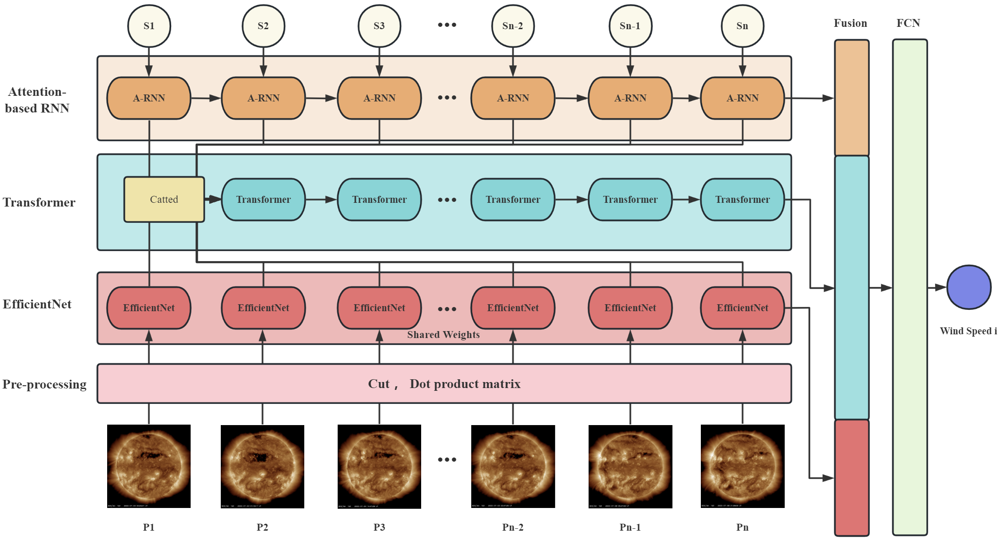
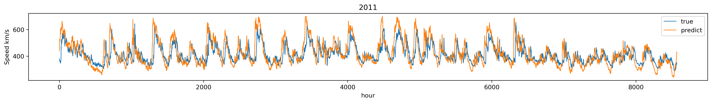
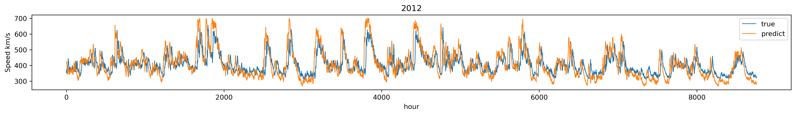
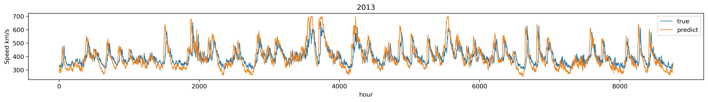
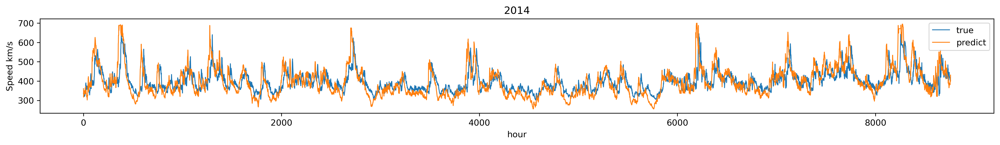
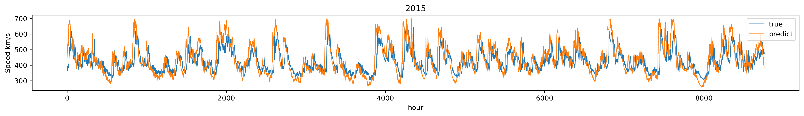
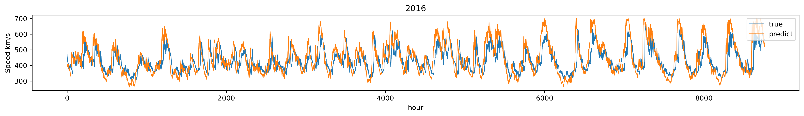
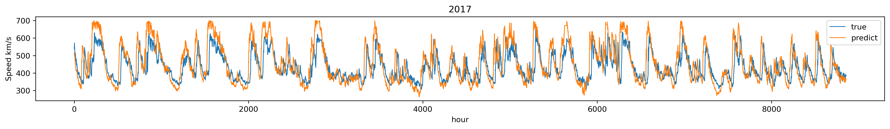
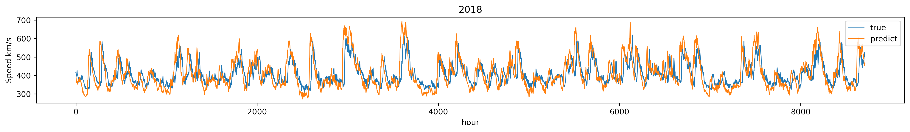

# STA
Spatio-temporal Attention Model with Prior Knowledge for Solar Wind Speed Prediction.
> ICANN(IN REVIEW)
> The complete code will be uploaded to the repository after the review.

## Abstract.
Solar wind prediction is a critical aspect of space weather forecasting, and current research has primarily focused on feature extraction from historical wind speed or individual solar images. To enhance the quality of data and improve prediction accuracy, we propose a novel approach that leverages multi-modality, combining both temporal and spatial dimensions. Additionally, we utilize prior knowledge to guide model training, specifically in the image preprocessing and matrix multiplication stages, where prior knowledge constraints are applied. Our study introduces the spatio-temporal attention model (STA) for solar wind prediction, which comprises an image branch and a solar wind speed data branch. The image branch uses a shared-weight feature extraction network to extract features from EUV images, while the solar wind speed data branch models temporal dynamics with sequence networks. Furthermore, we incorporated an attention-based feature extraction module and a feature fusion module to enhance the model's performance. Our experimental results demonstrate that the proposed STA model outperforms existing state-of-the-art models. Our study provides a novel approach to integrating prior knowledge and multi-modality for solar wind prediction, with significant implications for space weather forecasting.

## Data
### SDOML

### OMNI

## Assessment Criteria
RMSE
CC

## model

## Results

